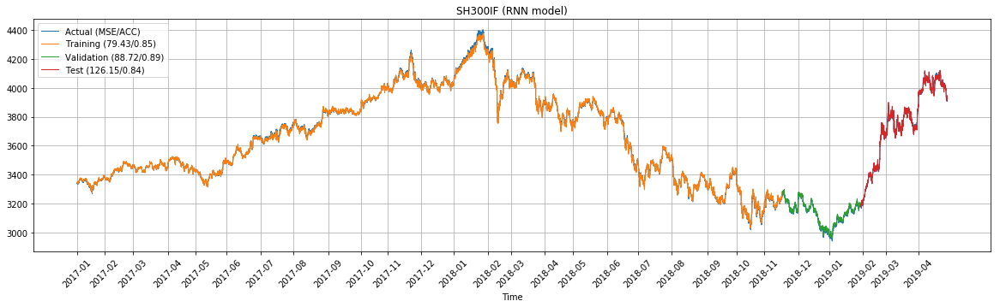
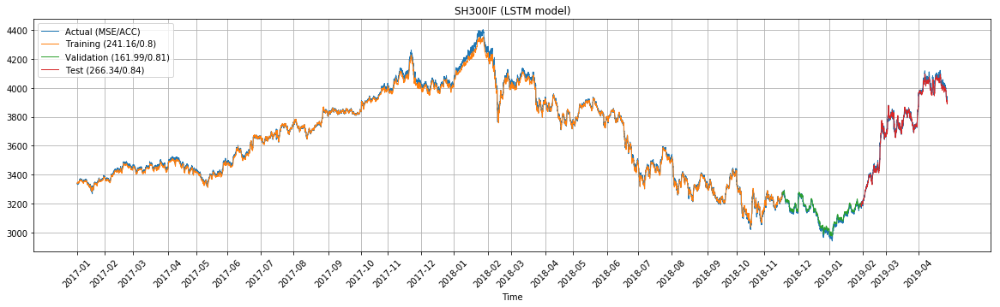
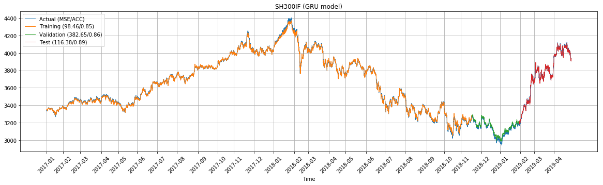
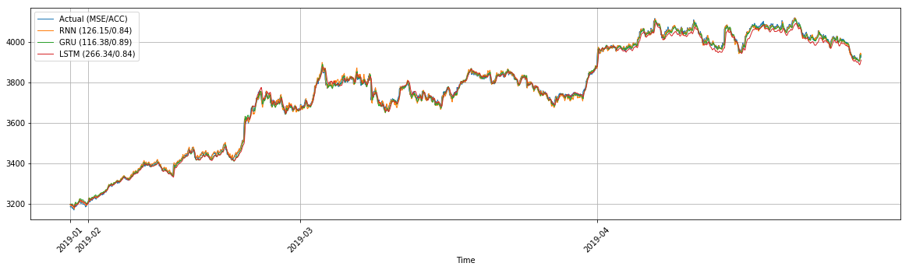

## Predict Stock Market Index Using RNNs

### Project Overview
The work is part of continuing research that is to examine the feasibility and performance of machine learning architectures in predicting time series data. Our focus at this point is on Recurrent Neural Network (RNN). We are going to tackle the problem of stock market index prediction, using datasets comprised of futures trading occurring on the China Financial Futures Exchange (CFFEX) during a 9-year period from April 2010 to April 2019. Three models have been implemented using Keras with Tensorflow backend:
* RNN 
* RNN with LSTM
* RNN with GRU 

### Results
Being trained with the 2-year-long CSI-300 5-minute data, the models can predict future index of the 3-month-long test data with a high degree of accuracy. All of the three models achieved comparable performance, as summarized below.  

| Models | MSE | RMSE | Accuracy |
| :-----: | :-----: | :-----: | :-----:|
| RNN | 126.15 | 11.23 | 0.84 |
| LSTM | 266.34 | 16.32 | 0.84 |
| GRU | 116.38 | 10.79 | 0.89 | 

The accuracy metrics reported above refers to hourly mean directional predictive accuracy, which compares the movement direction (upward or downward) of prediction to that of actual observation, with 1-hour look-back period.

The basic RNN model

The LSTM RNN model

The GRU RNN model

Comparing the performance of the three models running on the test data (Feb. - Apr. 2019) 

### Repo Contents
* `data/` : directory containing Shanghai-Shenzhen CSI-300 5-minute data between Apr. 2010 and Apr. 2019.
* `figures/` : directory containing plots generated by objects of the `ModelPredictions` class.
* `src/` : python and jupyter notebook source codes:
  * `data-prepration.py` : defines the `StockIndexDataset` class that builds a pipeline for data extraction and pre-processing (transformation, slicing, trimming).
  * `rnn-model.py` : defines the `ModelPredictions` class that builds the models, stores and visualizes outputs.
  * `utils.py` : includes some python helper functions, including plotting and date manipulation.
  * `predict-stock-rnn.ipynb` : main script in jupyter notebook.

### Dependencies
* Python 3
* [Tensorflow](https://www.tensorflow.org/)
* [Keras](https://keras.io/)
* numpy
* pandas
* matplotlib
* sklearn

### Reference Papers
* Moghaddam A. H., Moghaddam M. H., and Esfandyari M. (2016). "Stock market index prediction using artificial neural network" Journal of Economics, Finance and Administrative Science 21 (41): 89-93.
* Hiransha M., Gopalakrishnan E. A., Menonab V. K., Soman K.P (2018). "NSE Stock Market Prediction Using Deep-Learning Models" International Conference on Computational Intelligence and Data Science (ICCIDS 2018).

  
